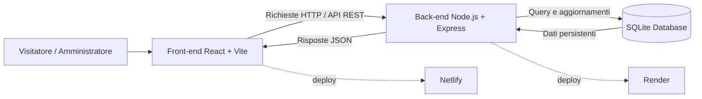

# Architettura

_Questo diagramma rappresenta l’architettura applicativa preliminare di MuseoHub._  
_Mostra la comunicazione tra front-end, back-end, database e servizi di deploy._

---

## Nota sul livello di dettaglio

Il diagramma rappresenta l’architettura preliminare del prototipo.  
Gli endpoint specifici saranno descritti nel documento dedicato alle API.
