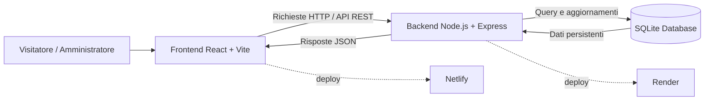
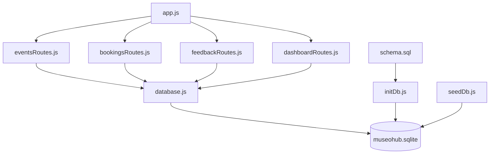

# Architettura

_Questo diagramma rappresenta l’architettura applicativa preliminare di MuseoHub._  
_Mostra la comunicazione tra frontend, backend, database e servizi di deploy._

---

## Flusso backend e database

