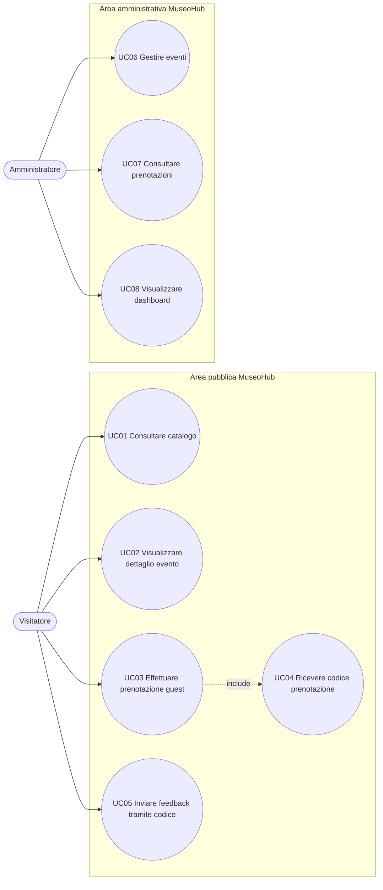

# Diagramma casi d’uso

_Questo diagramma rappresenta gli attori principali di MuseoHub e le funzionalità con cui interagiscono._  
_Serve a sintetizzare le azioni previste per visitatore e amministratore._

---

