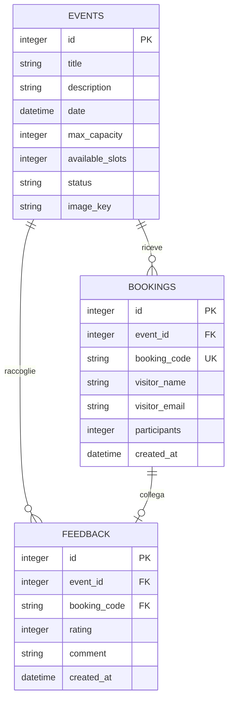

# Modello dati

_Questo diagramma rappresenta il modello dati del prototipo MuseoHub._  
_Mostra le entità principali e le relazioni previste tra eventi, prenotazioni e feedback._

---

```mermaid
erDiagram
    EVENTS ||--o{ BOOKINGS : riceve
    EVENTS ||--o{ FEEDBACK : raccoglie
    BOOKINGS ||--o| FEEDBACK : collega

    EVENTS {
        integer id PK
        string title
        string description
        datetime date
        integer max_capacity
        integer available_slots
        string status
        string image_key
    }

    BOOKINGS {
        integer id PK
        integer event_id FK
        string booking_code UK
        string visitor_name
        string visitor_email
        integer participants
        datetime created_at
    }

    FEEDBACK {
        integer id PK
        integer event_id FK
        string booking_code FK
        integer rating
        string comment
        datetime created_at
    }
```
