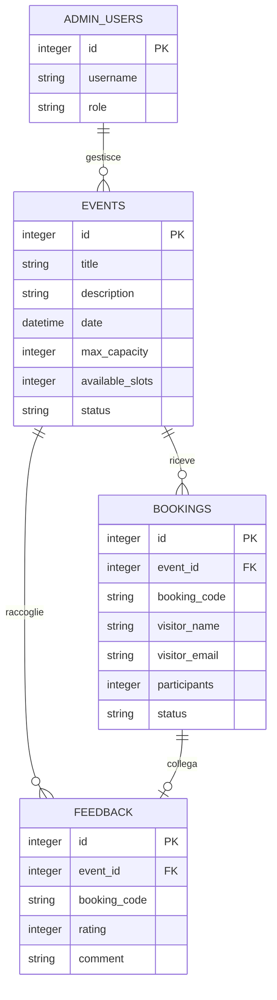

# Modello dati

_Questo diagramma rappresenta il modello dati preliminare di MuseoHub._  
_Mostra le entità principali e le relazioni previste tra eventi, prenotazioni, feedback e amministratore._

---

