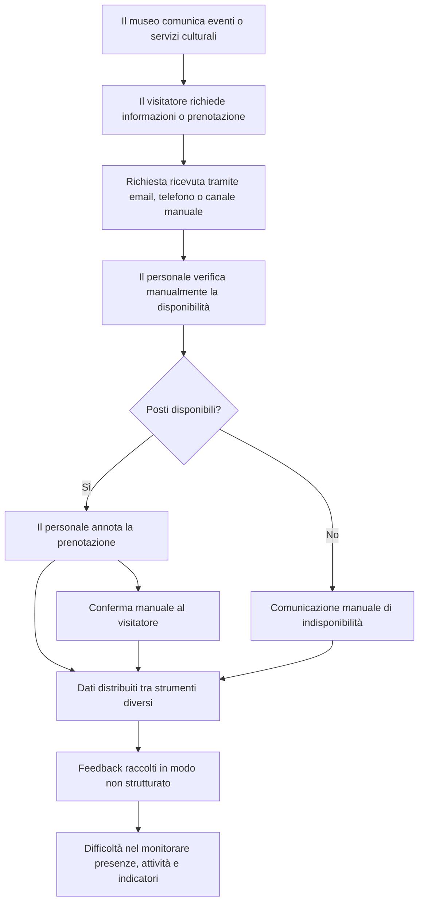

# Processo attuale

_Questo diagramma rappresenta il processo simulato prima dell’introduzione di MuseoHub._
_Serve a evidenziare la gestione frammentata di eventi, prenotazioni, disponibilità e feedback._

---

