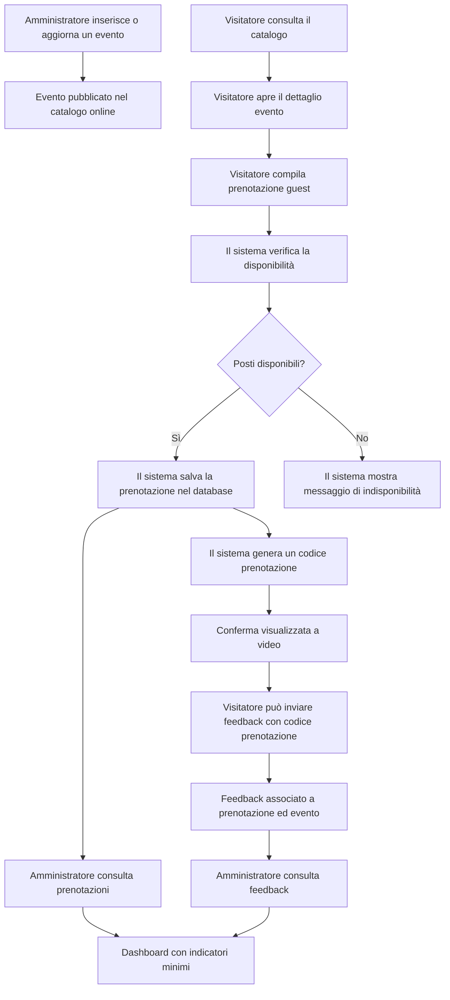

# Processo digitalizzato

_Questo diagramma rappresenta il processo previsto con MuseoHub._
_Serve a mostrare il passaggio da una gestione manuale a un flusso digitale basato su catalogo, prenotazione guest, database e area amministrativa.\*_

---

