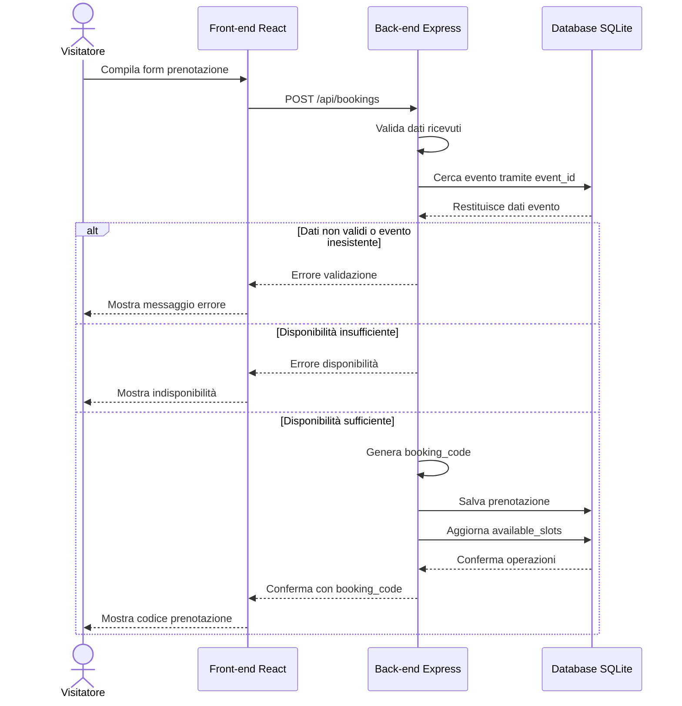

# Sequence prenotazione

_Questo diagramma rappresenta il flusso tecnico della prenotazione guest._  
_Mostra l’interazione tra visitatore, front-end, back-end e database durante verifica disponibilità, salvataggio e restituzione del codice prenotazione._

---

